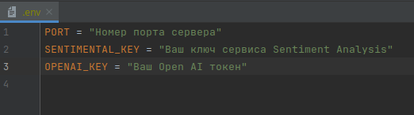
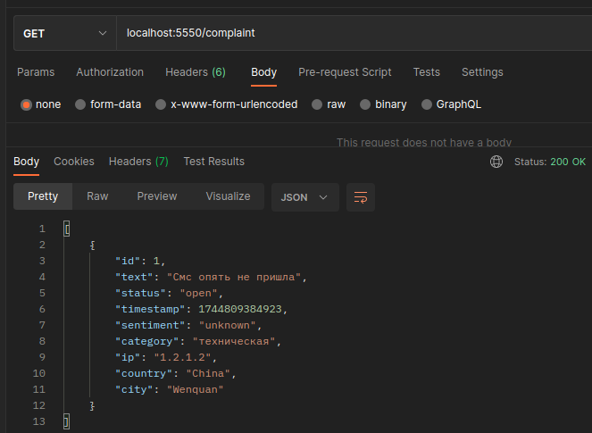
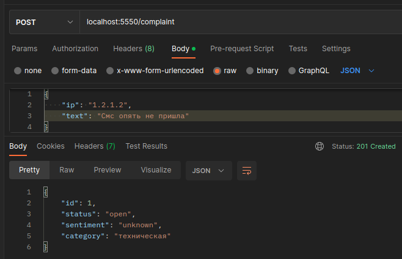
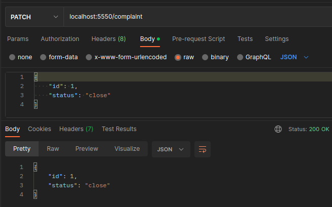

# Polza Agency

1. Скопируйте репозиторий в свою папку на сервере командой: <code>git clone https://github.com/ISannyI/polza_agency .</code>
2. Установите зависимости репозитория командой: <code>npm install</code>
3. Создайте файл в корне проекта с именем <code>.env</code> и заполните переменными <code>PORT = <Номер порта></code> <code>SENTIMENTAL_KEY = <Ключ сервиса Sentiment Analysis></code> <code>OPENAI_KEY = <Токен сервиса OpenAI></code> 
Пример заполнения:
4. Запустите сервер командой: <code>node index.js</code>

Сервер принимает запросы на <code><имя сервера>:<порт>/complaint</code>
1. <code>GET</code> - отправляет данные с статусом = open 
2. <code>POST</code> - принимает новую жалобу. Данные передавать в теле запроса вида JSON: <code>{"ip": "8.8.8.8", "text": "Не пришла смс"}</code> 
3. <code>PATCH</code> - обновляет данные в строке по номеру id. Данные передавать в теле запроса вида JSON: <code>{"id": "1", "status": "close"}</code> 
